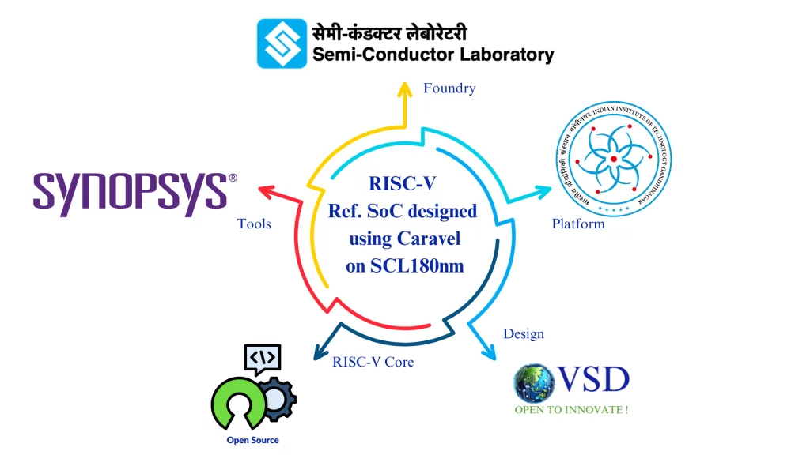

<h1 align="center">
🚀 RISC-V Reference SoC Tapeout Program  
</h1>

  
  
  

---

## 📖 About This Repository  

This repository documents my **20-week journey** through the **RISC-V Reference SoC Tapeout Program**, a national-level initiative organized by **IIT Gandhinagar (IITGN)** and **VLSI System Design (VSD)**.  

The program provides **hands-on training** in complete chip design — from **RTL design, synthesis, verification, and physical design, all the way to GDSII tapeout and silicon fabrication** — using industry-grade open source and Synopsys tools and the **SCL180nm PDK**.  

I will update this repo **week-by-week** with tasks, learnings, tool setups, and results.  

---

## 📅 Weekly Progress Tracker  

| Week | Focus Area | Repo Link | Status |
|------|------------|-----------|--------|
| 0 | Environment Setup & Tool Installation | [🔗 Week-0 Repo](./week00/README.md) | ✅ Completed |

---

## 🛠️ Tools & Environment  

For Week-0, I installed the essential **open-source EDA tools**:  

- **Yosys** → Logic synthesis & optimization  
- **Icarus Verilog (iverilog)** → Verilog simulation  
- **GTKWave** → Waveform viewing and debugging  

---

## 🙏 Acknowledgments

I would like to thank:

* [**Kunal Ghosh**](https://github.com/kunalg123) and Team **[VLSI System Design (VSD)](https://vsdiat.vlsisystemdesign.com/)** for leading the initiative.
* [**IIT Gandhinagar**](https://iitgn.ac.in/), [**Semiconductor Laboratory (SCL)**](https://www.scl.gov.in/), and [**Synopsys**](https://www.synopsys.com/) for their support.  
* The [**India Semiconductor Mission (ISM)**](https://ism.gov.in/) for enabling students across India to participate.

---

👨‍💻 **Participant:** [Rupam Bora](https://github.com/RupamBora-ASIC)
📅 **Program Duration:** 20 Weeks
🎯 **Goal:** Reach Top-20 Finalists for **GDSII Tapeout @ IITGN**

