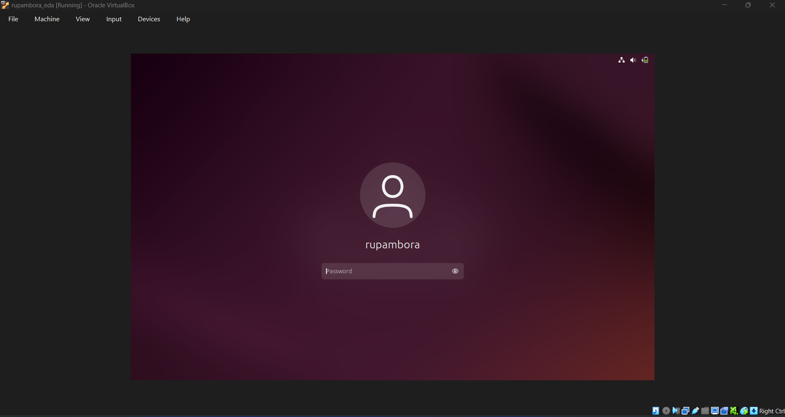
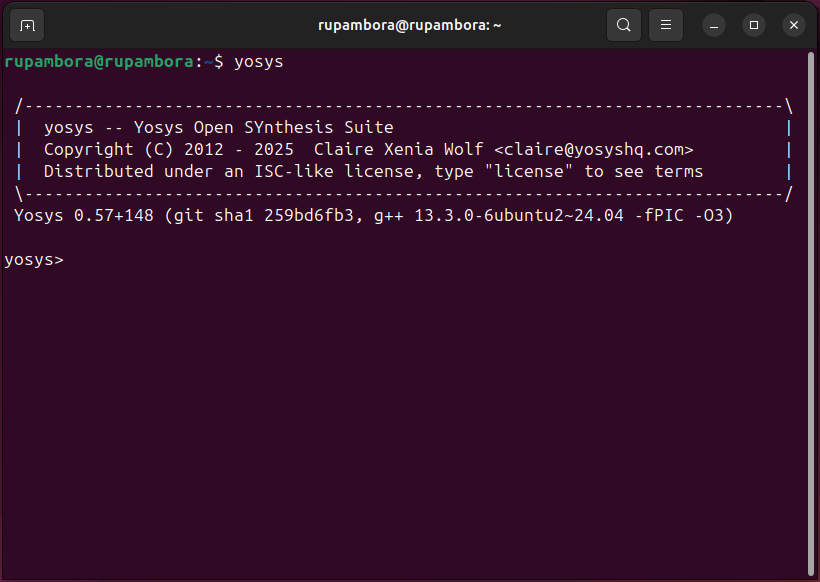
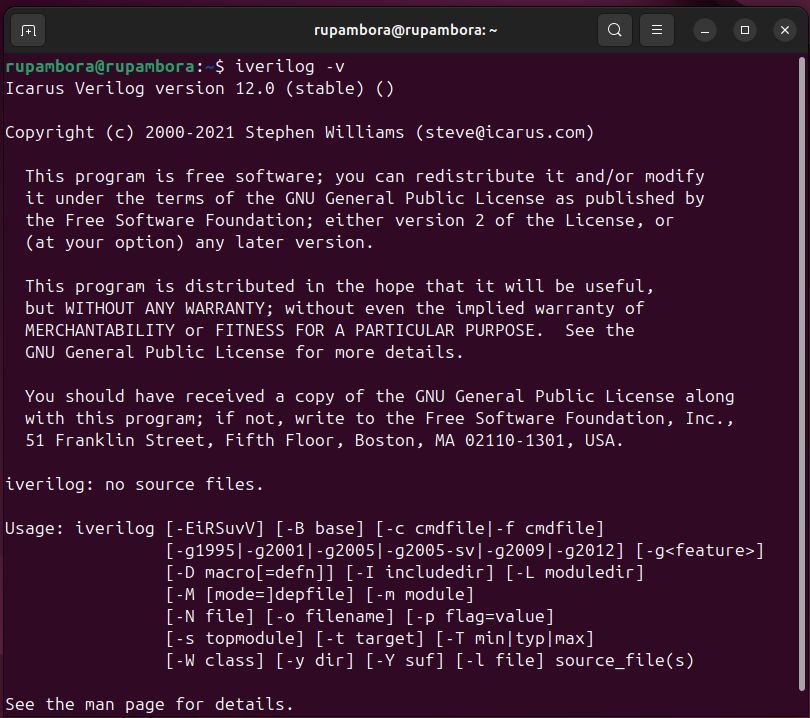
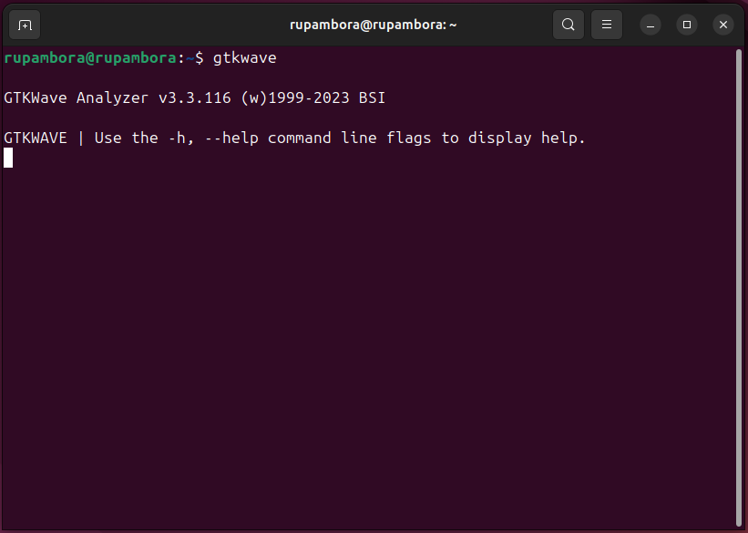
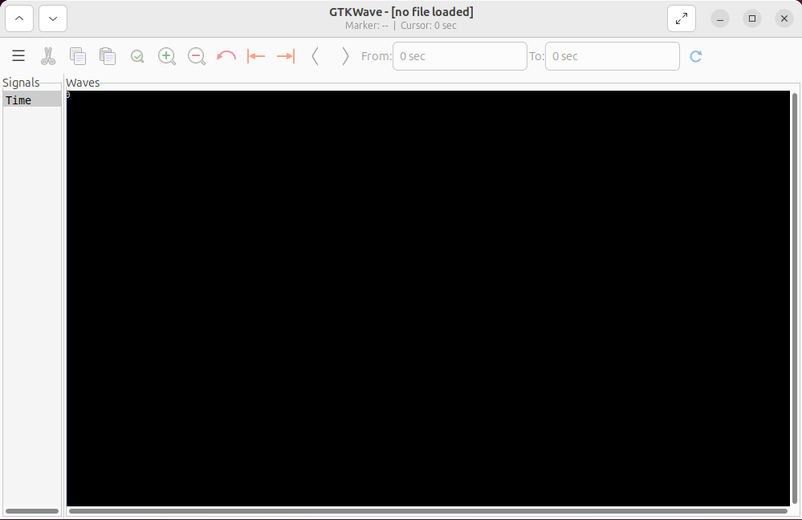

# 🚀 RISC-V Reference SoC Tapeout Program — Week 0  

This repository documents **Week-0 tasks** of the RISC-V Reference SoC Tapeout Program.  
The focus is on setting up the development environment and validating tool installation for RTL design and simulation.  

---

## 📌 Week-0 Tasks  

### 🎉 Welcome Call / Inauguration Highlights

The RISC-V Tapeout Program inauguration marked a historic step for India’s largest online academic tapeout initiative, with **3500+ participants** collaborating to design and build silicon.

* **[Dr. Rajat Moona (IITGN)](https://www.linkedin.com/in/rajatmoona/)** inspired participants to embrace the challenge and build a national chip design ecosystem.
* **[Samir Patel](https://www.linkedin.com/in/samir-patel-9099982/)** emphasized the role of **[India Semiconductor Mission](https://www.linkedin.com/company/indiasemiconductormission/posts/?feedView=all/)** for driving India’s self-reliant semiconductor journey and emphasized that this program is part of a larger national movement.
* **[Mohamed Kassem](https://www.linkedin.com/in/mkkassem/)**, a pioneer at **[Efabless](https://www.linkedin.com/company/efabless/)** and now leading **[ChipFoundry](https://www.linkedin.com/company/chipfoundry/posts/?feedView=all/)**, whose open-source contributions continue to create opportunities for students and startups globally.

The energy and vision shared during the session set the stage for an exciting 20-week journey into chip design.

---

### ✅ Task-1: GitHub Setup & Documentation  
- Created this GitHub repository.  
- Documented the summary of the kickoff session and initial setup steps.  

#### RISC-V SoC Design Flow – From C Code to Silicon

Summary of the step-by-step flow of designing a processor and SoC, moving from **specifications → RTL → GDSII → Silicon**.


---

#### 1. Application & Specification Validation

* Start with an application (e.g., calculator in **C**).
* **Step 1**: Compile with `GCC` → get output **O0**.
* **Step 2**: Compile with **specification model (RISC-V GCC)** → get output **O1**.
* **Goal**: Ensure **O0 = O1** → specification is frozen.


---

#### 2. RTL Modeling & Functional Verification

* Write a **soft copy of hardware** (using Verilog, Chisel, or Bluespec).
* Run application → output **O2**.
* **Goal**: Ensure **O1 = O2**.


---

#### 3. SoC Integration

* Split design into:
  * **Processor (synthesizable RTL)**
  * **Macros (synthesizable, reusable blocks)**
  * **Analog IPs (ADC, PLL – functional models only)**
* Integrate blocks via **GPIOs** into full SoC.
* Run application → output **O3**.
* **Goal**: Ensure **O1 = O2 = O3**.


---

#### 4. Microprocessor vs Microcontroller

* **Microprocessor**: CPU only (e.g., 8085/8086 kits).
* **Microcontroller**: CPU + peripherals + IPs in one package (e.g., Arduino ATmega).


---

#### 5. Physical Design (RTL → GDSII)

* Convert synthesizable RTL to gates using **standard cells**.
* Stages: **Floorplanning → Placement → CTS → Routing**.
* Output: **GDSII file** (graphical data for foundry).
* Run **DRC/LVS** checks → ensure correctness.


---

#### 6. Tapeout & Tape-in

* **Tape-out**: Send GDSII to foundry.
* **Tape-in**: Receive fabricated chips back (packaged).


---

#### 7. Post-Silicon Validation

* Mount chip on board (with memory, USB, clock sources, regulators).
* Run same application → output **O4**.
* **Goal**: Ensure **O1 = O2 = O3 = O4**.


---

#### 8. Timeline

* Full chip cycle ≈ **14–16 months**.
* Foundry turnaround: **4–6 months**.


---

#### 9. Example Use-Cases

* **Arduino-compatible boards** (25–50 MHz).
* **TV panels** (non-WiFi side).
* **AC controllers**.
* Target frequency: **100–130 MHz** (vs. GHz-class processors).


---

#### Key Takeaways

* **Silicon-proven** designs hold high industry value.
* The program focuses on **one block** of the SoC (blue block).
* Participants gain hands-on experience in:
  * Specification → RTL → SoC integration → PD → Tapeout.
  * Designing small IPs (e.g., inverter).
  * Validating chips post-silicon.


---


---

### ✅ Task-2: Tool Installation  

#### 🔹 Oracle VirtualBox (Host Setup)  
- [Download VirtualBox](https://www.virtualbox.org/wiki/Downloads)  
- Installed Ubuntu 20.04+ VM with the following specs:  
  - **4 vCPU**  
  - **6 GB RAM**  
  - **50 GB HDD**  

### VM Setup Snapshot  


---

#### 🔹 Toolchain Installation  

##### 1. **Yosys** (Synthesis Tool)  
```bash
sudo apt-get update
git clone https://github.com/YosysHQ/yosys.git
cd yosys
sudo apt install make build-essential clang bison flex \
libreadline-dev gawk tcl-dev libffi-dev git \
graphviz xdot pkg-config python3 libboost-system-dev \
libboost-python-dev libboost-filesystem-dev zlib1g-dev
make config-gcc
make
sudo make install
````

### Yosys Installation Snapshot  


---

##### 2. **Icarus Verilog (iverilog)** (Simulation Tool)

```bash
sudo apt-get update
sudo apt-get install iverilog
```

### Iverilog Installation Snapshot  


---

##### 3. **GTKWave** (Waveform Viewer)

```bash
sudo apt-get update
sudo apt install gtkwave
```

### GTKWave Installation Snapshot  



---

✍️ *Author: Rupam Bora*
📅 *Program Start: 18-09-2025*
